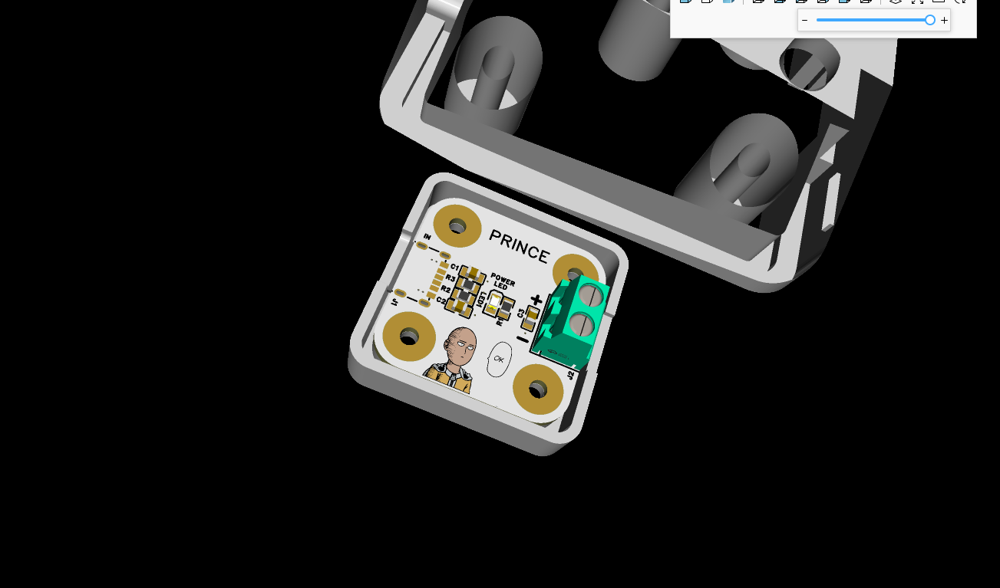
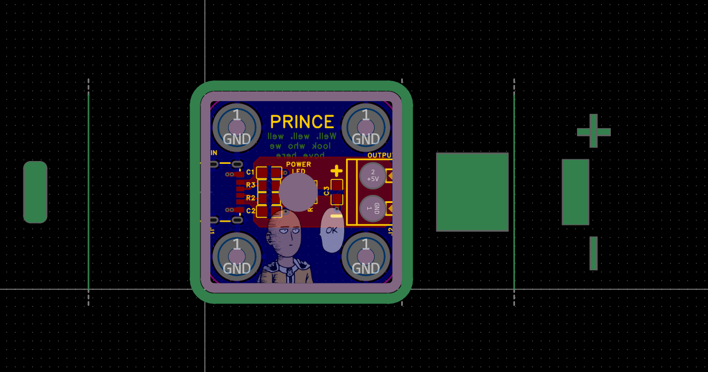
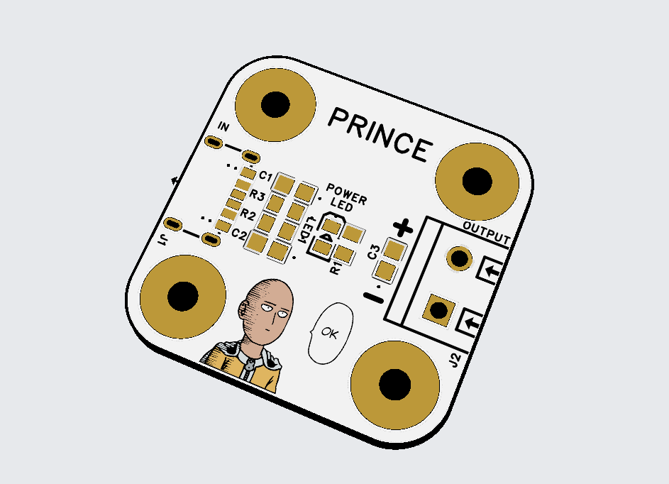
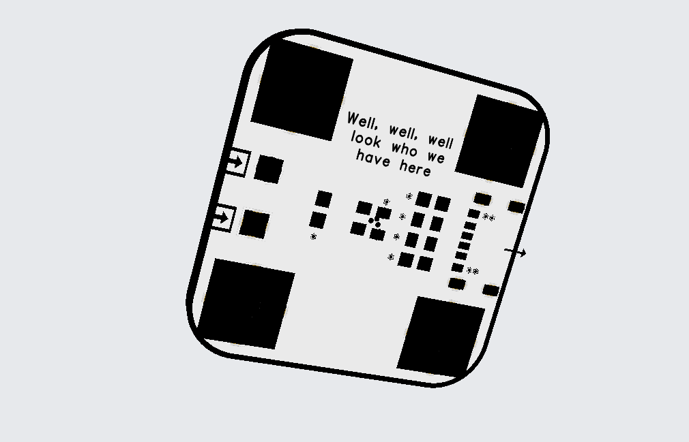
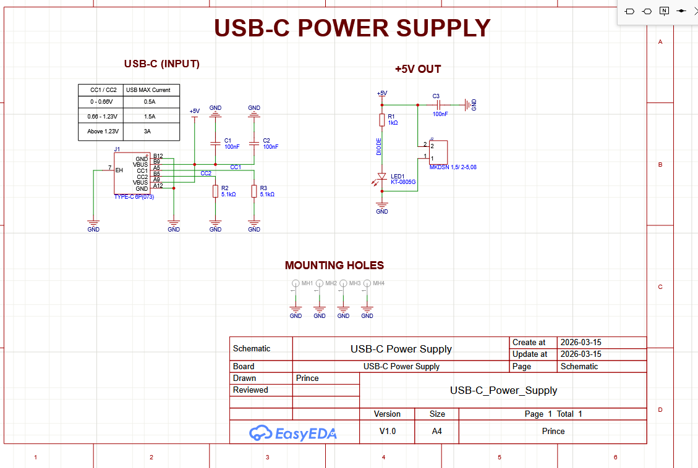

<h1 align="center">One Power Supply</h1>

USB-C Power Supply PCB Design

---

## Overview

  
  

  
  

---

## 3D + Enclosure

  

  
  

---

## Design Details

  
  

  
  

---

## Files Included

* Gerber files (Colour & No Colour)
* BOM (Bill of Materials)
* Pick and Place file
* 3D PCB + Shell design
* Altium design outputs

---

